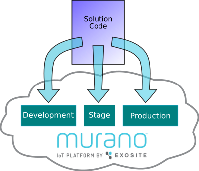

# Solution Deployment

A common task with developing software is deploying code to different environments.  This guide provides basic instructions for setup and deployment of three solutions (environments) with the same code.



# Prerequisites

* [Scripting Guide](http://docs.exosite.com/reference/scripting/)

# Create deployment solutions (environments)

Before deploying code, a single solution must exist for each environment to be deployed as well as an associated product for each solution.  The product may be re-used among the solutions as long as it is accessible to each.  The [Getting-Started Guides](../../get-started) can help with the creation of these components.  Follow the [solution creation example](../../get-started/solutions/exampleapp/) as needed.

# Code deployment

Code can then be deployed using Exosite's provided tool:
* [Murano CLI](http://docs.exosite.com/development/tools/murano-cli/)

The following strategy encourages storing configuration files separate from source control.  This allows one to deploy the same code to different environments.

## Deployment (exosite-cli)

The exosite-cli tool is used to deploy code to a solution environment.  Additional setup instructions are found in the [developer tools](../../exosite-cli) section.  Assuming you have exosite-cli installed and are ready to begin deploying, you can follow the steps below with the [exosite-config-env](https://raw.githubusercontent.com/quickcougar/exosite-cli/09650a707368548d488d95e31d7da10d2ba45208/bin/exosite-config-env) tool to deploy to different environments.  Credentials are likely to be reusable for each environment and can be generated with the `exosite --init` command.

Each environment will use a different configuration file that will contain your credentials, and identifiers for product and solution.  To create the files, first change into your project directory and execute the following commands.  **Change the IDs to suit your own specific environments.**
```
cat > .Solutionfile.secret.dev <<EOF
{
    "credential": "my_secret_credentials",
    "email": "myemail@customer.com",
    "product_id": "fea51b1eca5e10ad",
    "solution_id": "AAAAAAAA"
}
EOF

cat > .Solutionfile.secret.stg <<EOF
{
    "credential": "my_secret_credentials",
    "email": "myemail@customer.com",
    "product_id": "fea51b1eca5e10ad",
    "solution_id": "AAAAAAAA"
}
EOF

cat > .Solutionfile.secret.prod <<EOF
{
    "credential": "my_secret_credentials",
    "email": "myemail@customer.com",
    "product_id": "fea51b1eca5e10ad",
    "solution_id": "AAAAAAAA"
}
EOF

```

The three solution IDs are written to `.Solutionfile.secret.dev`, `.Solutionfile.secret.stg`, and `.Solutionfile.secret.prod`.

To deploy to the varying environments, execute the following commands from your project directory.
```bash
exosite-config-env dev
exosite --deploy

exosite-config-env stg
exosite --deploy

exosite-config-env prod
exosite --deploy
```

## Deployment (Murano CLI)

The Murano CLI tool is still considered experimental and is under active development.  However, it is expected to be the preferred tool choice very soon.

Each environment will use a different configuration file that will contain your business, product, and solution identifiers.  To create the files, first change into your project directory and execute the following commands.  **Change the IDs to suit your own specific environments.**
```
cat > .murano.dev <<EOF
[business]
id = 5caff01db1f0ca15

[product]
id = fea51b1eca5e10ad

[solution]
id=AAAAAAAA
EOF

cat > .murano.stg <<EOF
[business]
id = 5caff01db1f0ca15

[product]
id = fea51b1eca5e10ad

[solution]
id=BBBBBBBB
EOF

cat > .murano.prod <<EOF
[business]
id = 5caff01db1f0ca15

[product]
id = fea51b1eca5e10ad

[solution]
id=CCCCCCCC
EOF

cat > .env <<EOF
MURANO_CONFIGFILE=.murano.dev
EOF
```

The three solution IDs are written to `.murano.dev`, `.murano.stg`, and `.murano.prod`.

### MURANO_CONFIGFILE environment and Dotenv

The environment variable `MURANO_CONFIGFILE` can be used by Murano CLI to specify a configuration file to load.  In conjuction with [dotenv](https://github.com/bkeepers/dotenv) support, one can easilyy switch between the environments.

To deploy to the varying environments, change the MURANO_CONFIGFILE value and execute the "syncup" command similar to the following example.
```bash
export MURANO_CONFIGFILE=.murano.dev
murano syncup -V

export MURANO_CONFIGFILE=.murano.stg
murano syncup -V

export MURANO_CONFIGFILE=.murano.prod
murano syncup -V
```
### Additional help
* [Start a brand new project](https://github.com/exosite/MuranoCLI#to-start-a-brand-new-project-the-hard-way)
