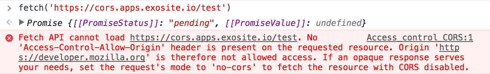
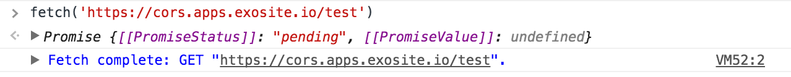

# Guide: Host Your App Externally

Murano can be used with mobile and existing frontend applications provided the Cross Origin Request Sharing (CORS) settings on your solution are configured properly.

This guide will go through configuring your CORS file with the `murano` CLI tool.

CORS is a way to mitigate cross origin attacks in the browser. Want to learn more about CORS? [Click here.](https://developer.mozilla.org/en-US/docs/Web/HTTP/Access_control_CORS)

# CORS by Example

In this example, you can make requests from `https://exosite.com` to Exosite's Solution API, which is hosted at `https://cors.apps.exosite.io`. You will only use the API portion of the solution. It will not host any frontend files. Depending on the initial configuration of CORS in your solution, these requests may succeed (if `origin: true` is set in your `cors.yaml` file).

## Initial assumptions
- You have created [a solution](http://docs.exosite.com/guides/create-solution/).
- You have synced your solution locally with `mr syncdown` and the cors configuration with `mr syncdown --cors`.
- You have a test endpoint. For this example, the test endpoint is:
~~~
$ cat endpoints/test.lua
--#ENDPOINT GET /test
return 'success!'
~~~

**Note:** Ensure `origin: true` is not present in the `cors.yaml` file. If `origin` is set to `true`, all requests from all domains will be allowed. If your default cors.yaml file is configured this way, modify the origin line to the following:
~~~
origin:
- http://localhost:3000
- https://exosite.com
~~~

The complete `cors.yaml` is as follows:
~~~
$ cat cors.yaml
---
origin:
- http://localhost:3000
methods:
- HEAD
- GET
- POST
- PUT
- DELETE
- OPTIONS
- PATCH
headers:
- Content-Type
- Cookie
- Authorization
credentials: true
~~~

Run `mr syncup --cors` to sync your `cors.yaml` file changes.

# Make the Request

1. Go to `https://exosite.com`, open the developer console, and type `fetch('https://cors.apps.exosite.io/test')` in the console. You will get an error similar to the following:

  

  This means that the remote URL (Exosite's Solution API) is not configured to accept requests from the `exosite.com`.

1. To enable `exosite.com` to make requests to your solution, modify the `origin` line of `cors.yaml` to be as follows:

  ~~~
  origin:
  - http://localhost:3000
  - https://exosite.com
  ~~~

1. Run `mr syncup --cors`.

1. Go back to the browser, then run `fetch('https://cors.apps.exosite.io/test')`. Instead of an error, you should see a succesful `GET` request.

By setting your CORS configuration to allow requests from `https://exosite.com`, you could successfully request resources from other domains.

# Enable on Your Mobile Application or Existing Frontend

The same techniques used above can be used to request data from your Murano API. Simply make requests to your solution's API using your frontend client or your server to gain the benefits of IoT in your current application without migrating your entire frontend.
