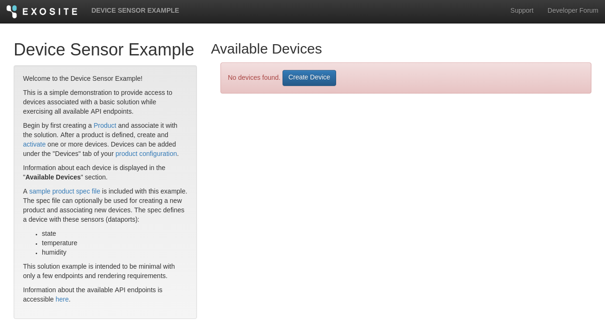
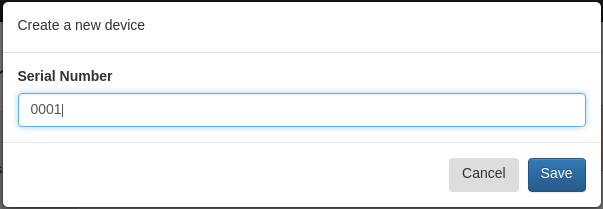
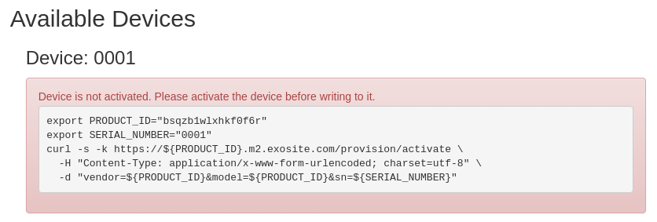
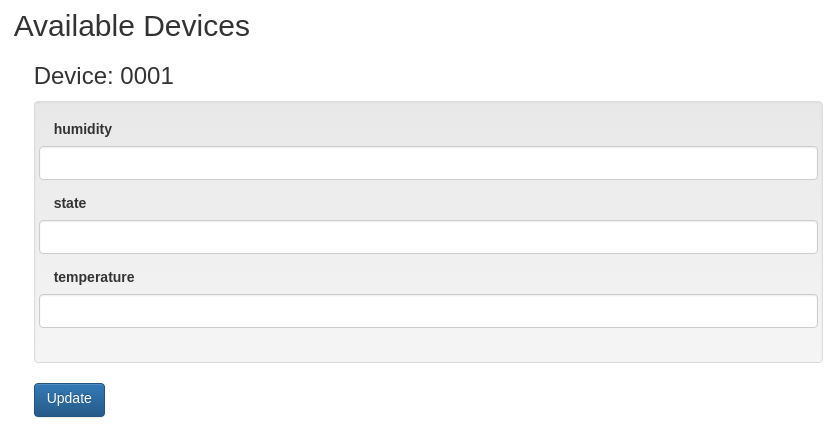
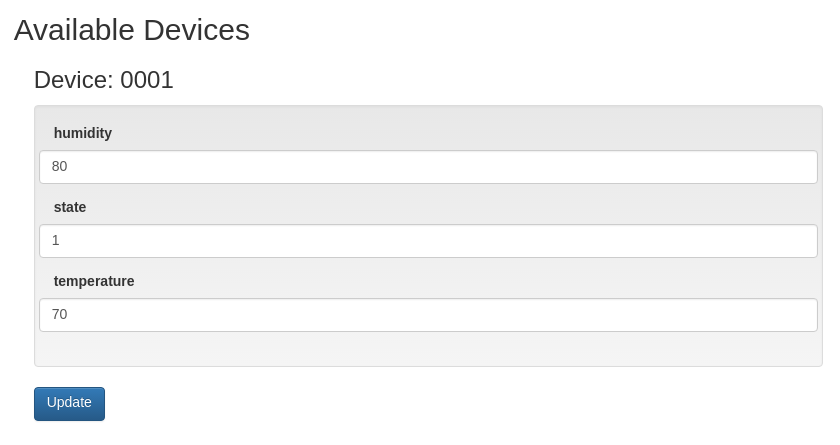
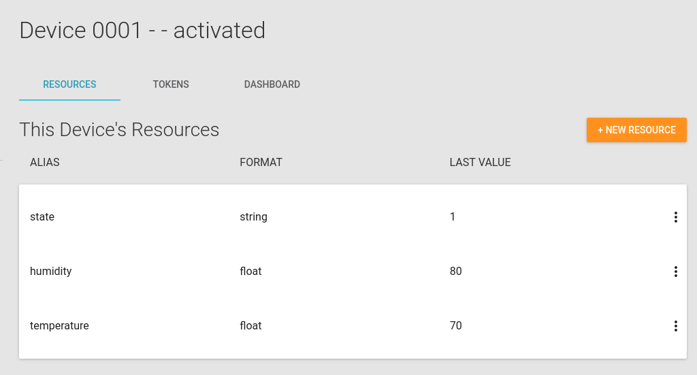

# Device Sensor Quickstart

This quickstart is a simple demonstration to provide access to devices associated with a basic Solution while exercising all the available endpoints. After devices are created and activated, you will see information about each device on your *DEVICES* page.

This application is written as a basic HTML/JavaScript app with Murano Solution event handlers, routes, modules, and static assets. This example is intended to be minimal, with only a few endpoints and rendering requirements.

## Using This Example

Clone this [repository](https://github.com/exosite/device-sensor-quickstart/).

```sh
git clone git@github.com:exosite/device-sensor-example.git
cd device-sensor-example
```

To deploy this application, first [Create a Solution](http://docs.exosite.com/reference/ui/create-solution/) in [Exosite Murano](https://www.exosite.io/business/solutions) then [Create a Product](http://docs.exosite.com/reference/ui/create-product/) in [Exosite Murano](https://www.exosite.io/business/products).

Next, install the [Murano Command Line Tool](http://docs.exosite.com/development/tools/murano-cli/) then initialize the project with your Solution ID and Product ID using the following commands (where XXXXXX is your respective identifier):

```sh 
murano config business.id XXXXXX
murano config solution.id XXXXXX
murano config product.id XXXXXX
murano -V syncup --all
murano assign set
```

Navigate to your [Solution](https://www.exosite.io/business/solutions) web application at an address similar to:
https://mysolution.apps.exosite.io

Information about the available API endpoints is accessible at the /docs URL of your deployed solution (e.g., https://mysolution.apps.exosite.io/docs).

When you first navigate to the newly deployed solution, you won't have any devices set up.



Click 'Create Device' and add a new device with serial number 0001.



The device will be added, but we'll need to activate it. Use your terminal to copy and paste the code that is displayed in the page.



After you activate, refresh your page and you'll see input fields for your device.



When you enter values into these fields, the data is submitted to your device in the platform.



You can view the most recent values submitted to your device using the [Product](https://www.exosite.io/business/products/) page in Exosite Murano.



