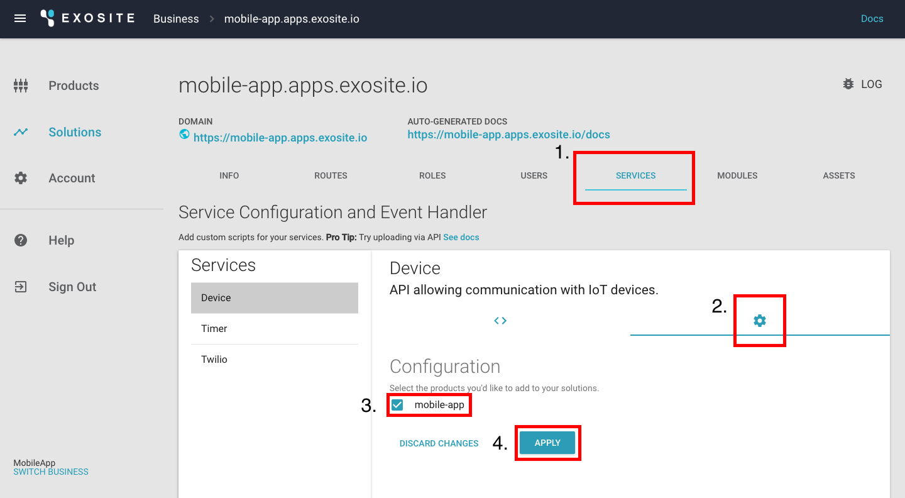
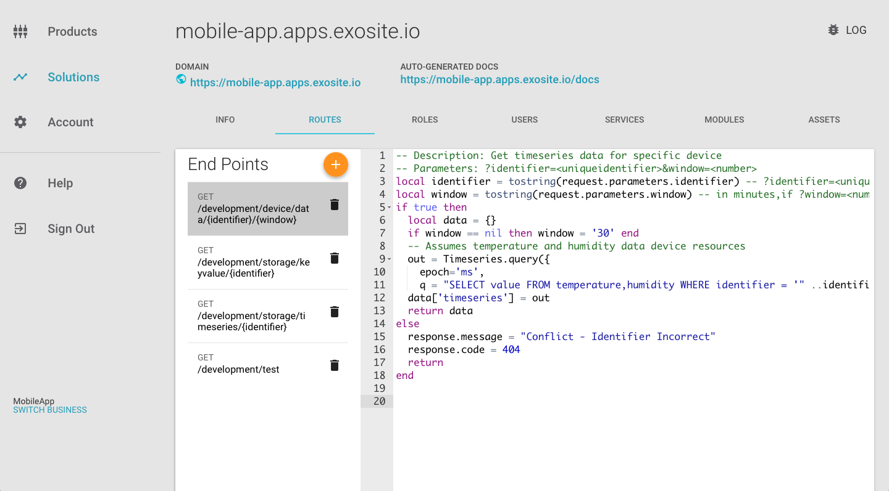
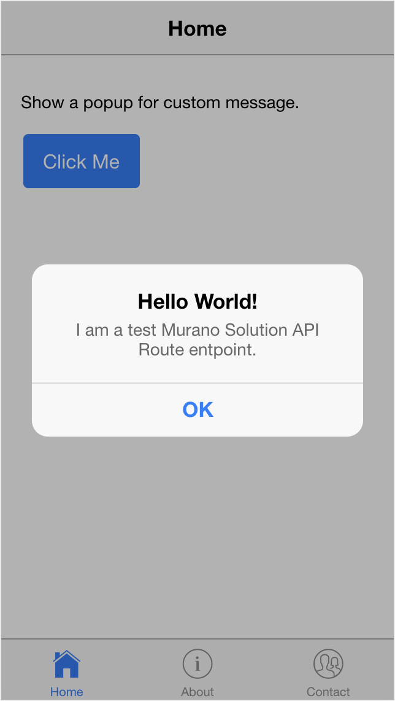
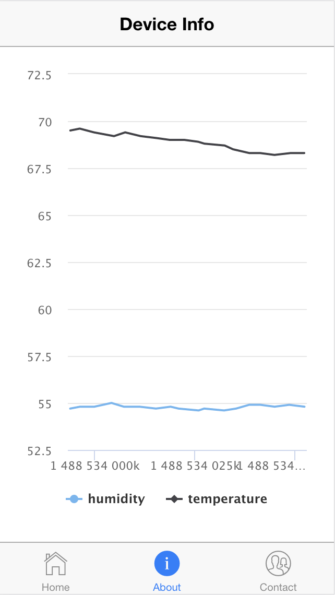

# Mobile Applications Quickstart

In this quickstart, you will walk through the key steps to develop and demo a functional mobile app with Murano’s cloud service.

# Prerequisites

This quickstart is designed for developers with some basic knowledge of mobile and web app development. 

## Protocol and API design

[REST API](https://www.tutorialspoint.com/restful/restful_introduction.htm)

[JSON Format](https://www.tutorialspoint.com/json/json_overview.htm)

## Programming Languages and Frameworks

[Ionic 2](http://ionicframework.com/docs/v2/intro/installation/)

**Note:** Ionic is a frontend mobile framework based on the Angular 2 framework, and Angular is based of Typescript, so if you have some knowledge of the these two languages will be helpful. 

#	Requirements

## Hardware Setup

* iOS

    [Devices uuid in whitelist](https://developer.apple.com/library/content/documentation/IDEs/Conceptual/AppDistributionGuide/MaintainingProfiles/MaintainingProfiles.html)

* Android

    [Enable debug mode](https://www.google.com.tw/webhp?sourceid=chrome-instant&rlz=1C5CHFA_enTW695TW695&ion=1&espv=2&ie=UTF-8#q=android+debug+mode+enable&*)

## Software Setup

* General

    [Nodejs](https://nodejs.org/en/)

    [Ionic](https://ionicframework.com/docs/)

    Cordova

* iOS

    Xcode

* [Android](https://ionicframework.com/docs/v2/resources/platform-setup/mac-setup.html)

    Android SDK

# Getting Started

## Develop the Mobile App

1. Set up basic IDE and SDK to enable your iOS or Android platform to compile mobile app.

```
1. git clone [git@github.com](mailto:git@github.com): <YourNameHere>/ionic2-example.git

2. npm install

3. ionic platform add ios

4. ionic run ios
```

**Note:** If you want to develop the app with an Android device, change the command to "ionic run android".

2. If you have not already done so, [Create a Solution](http://docs.exosite.com/guides/create-solution/) in Murano.

3. In your Murano solution, click on the *SERVICES* tab (1),  select the service *Device*, click the gear icon to open *Configuration *(2), select your product (3), and click the "APPLY" button (4).



4. Click on the *ROUTES* tab to open the four default end points.
   
    a. The  end point `GET /development/test`shows a demo message.
      
        
    
    b. The end point `GET /development/device/data/{identifier}/{window}` shows device temperature and humidity.
      
        

## Demo the Mobile App

1. Demo a button that will call API to trigger a prompt: "Hello World!" 

**Note**: This message can be customized and quickly updated on the solution.



2. Show real-time data on the cloud (humidity, temperature).




