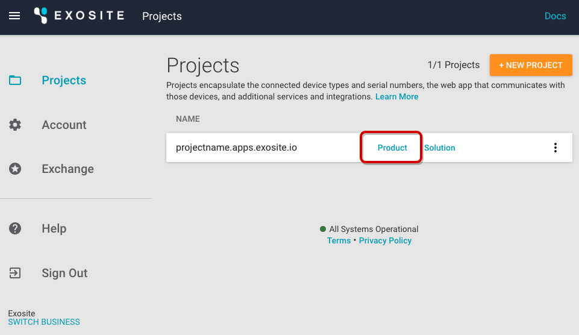
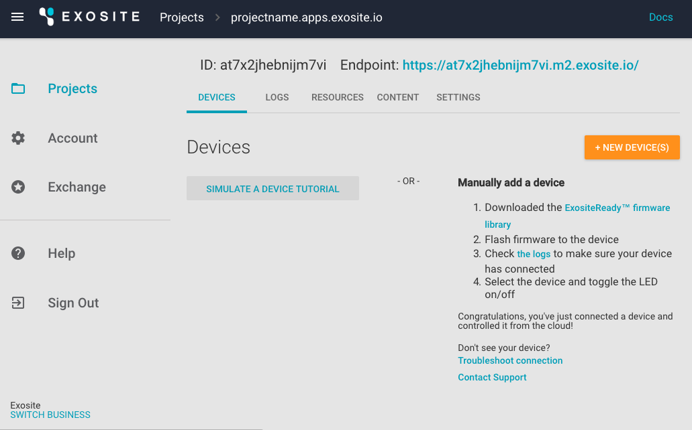
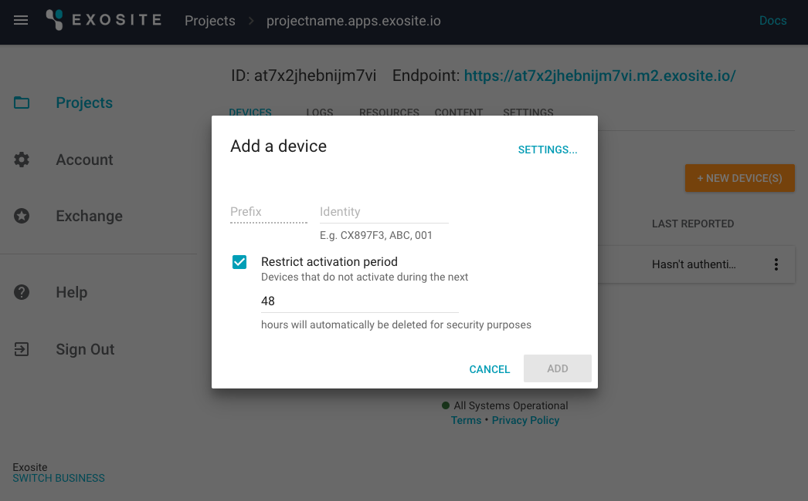
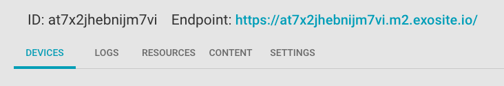
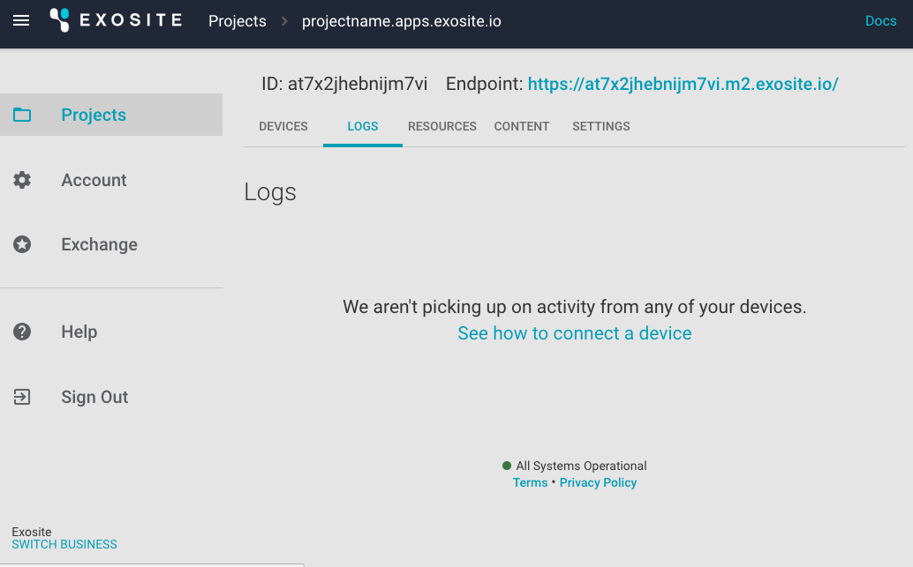
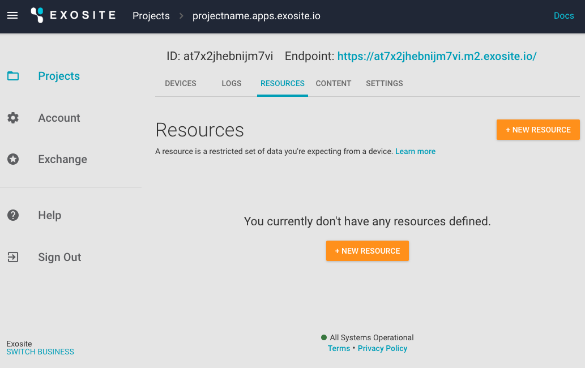
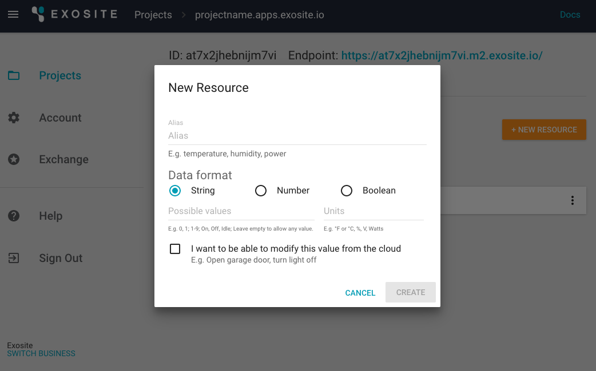
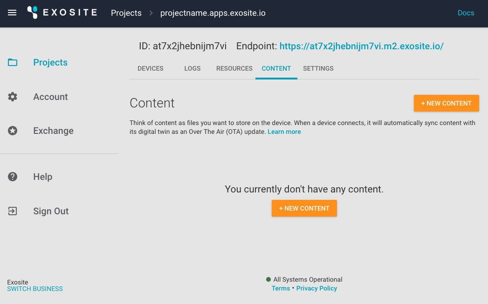
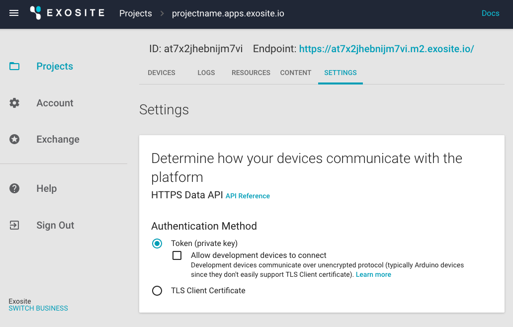
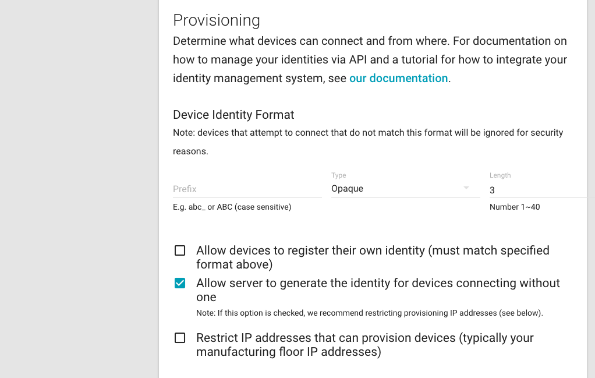

# ADC Page-by-Page Reference

This reference manual breaks down each page of Murano's Advanced Device Connectivity (ADC) feature and provides descriptions of each component's functionality. All ADC offerings are located within [Murano](https://www.exosite.io/business/) under the *Product* realm of your Project.

 

# ADC Pages
* [Devices](#devices)
* [Logs](#logs)
* [Resources](#resources)
* [Content](#content)
* [Settings](#settings)

# Devices

The *Devices* page is where you will add, list, and manage all your devices (real or simulated).
Once you have populated your list of devices, you will have the capability to search, sort, and filter your device list to suit your needs. 

 

When you click the “+ NEW DEVICE(S)” button, you will have the option to add one device or many devices at once. Depending on your account tier, there may be a limit on the number of devices you are able to add. 

**NOTE:** the *Endpoint* URL at the top of the screen is the host name that has been created to receive your devices' outgoing API calls.  

# Logs

The *Logs* page is where you may access a connection log of each device’s meta data.

 

# Resources

The *Resources* page is where you may add attributes (or "alias"es) to your devices (e.g., temperature, status, etc.). Resources represent a device's digital twin in the cloud. A resource is identified by its alias, and the resource's unit (e.g., °C) can be specified to further clarify the alias's measurement. It is possible to restrict values to ranges (0-100) or to discrete values ("open", "closed", "jammed"). The current resource value for a given device is visible when browsing the device in the project and is accessible to scripts, which can then act on reported values in any number of ways.

 

When you click "+ NEW RESOURCE", you will be prompted to choose your data format. 
* *String* refers to a unicode sequence of characters. 
* *Number* refers to any positive or negative value. 
* *Boolean* refers to a binary variable (i.e., true or false).

You will also be given the option to "modify this value from the cloud." Leaving this box unchecked will allow only the device itself to write to the alias. Checking this box will allow other applications to modify the value of the resource, depending on the permissions you have put in place. 

Typically, devices report values to resources that are "read-only" in the cloud. It is possible to enable writing from the cloud, which can be used to support command-and-control behavior. All resources have a "reported" value which represents the last value written by the device (using the write API). Resources that are cloud-writeable have an additional "set" value assigned when a write occurs from the cloud. The read API will return the "set" value (not the "reported" value) in this case; note, however, that a device write will replace both the "set" and the "reported" value. Devices will use either the read API or the long-polling API to receive control requests and then write appropriate resource updates to reflect its having acted on the request.

Devices are not restricted to write to only defined resources. Devices write to "alias"es which may or may not correspond to defined resources. All device writes are sent to the event handler and can be processed by scripts, but only writes to defined resources will have "reported" values stored, available to devices via "read" and visible when viewing the device online. Additionally, only resources that are cloud-modifiable will have "set" values.

# Content

The *Content* page serves as a file store that your devices can access and utilize through the API. Click “+ NEW CONTENT” and follow the prompts to upload your files. Each content item has an ID, a MIME type, a size (in bytes), and a timestamp. Devices may list available content, get content info, and download content using the [HTTP Device API](/reference/products/device-api/http/).

 

There is no restriction as to the kind of content that can be made available to devices. Files can contain anything from audio/video content to config data, but the typical use case is to store firmware updates. For content that gets updated over time, such as with new firmware versions, it is recommended to include in the ID some kind of version tag. Whether this approach is taken or the content is updated in place and a timestamp is used to differentiate, devices will need a means to know which version they are at. Exosite recommends storing this information in a [Resource](#resources). Additionally, if the resource is cloud-modifiable, the device can be notified when new firmware is available.
 
**Note:** Content items must be less than 64 MB in size.

# Settings

The *Settings* page allows you to set your authentication method and determine which devices can connect. 

Selecting the *Token* option enables a character string for the authorization of your devices’ communication with Murano. Development devices connecting via HTTP must authenticate using CIK (private key). Such devices should not go into production; any devices using HTTP in development that are intended for production should be reprovisioned when TLS is enabled.

**NOTE:** Enabling the "Allow development devices to connect" checkbox removes the requirement to use HTTPS and allows straight-HTTP, which is not encrypted and for which all information, including sensitive data like the CIK (private key), is passed in plaintext and easily read by third parties. It is highly discouraged to run in this mode, but activities—particularly those during the development of the device—make doing so useful under limited circumstances. 

The *TLS Client Certificate* option enables authentication and identification of devices via parameters of the client certificate.

 

## Provisioning

Farther down on the *Settings* page, you may select your provisioning settings. Provisioning is the process by which a device acquires credentials consisting of an identity and a secure means of verifying that identity. Devices connecting for the first time may do so fully provisioned (presenting both identity and verification of that identity), may present only their identity, or may require both an identity and verification; of these, devices fully provisioned as part of the manufacturing process are considered the most secure, as they can not be spoofed and the private aspect of the verification need not be sent to them; provisioning opens the possibility that illegitimate devices can appear as legitimate and be granted access.

When provisioning a device, the device may present its own identity (assuming "Allow devices to register their own identity" is selected). Such devices will have an identity (such as a MAC address) that must match the specified format. Alternatively, a device may receive an identity (when "Allow server to generate the identity for devices connecting without one" is selected). In either case, it is possible for illegitimate devices to successfully provision; presented identity provides a slightly greater barrier due to its identity format validation. It is possible to further restrict provisioning to only those devices with particular IP Addresses.

 
