In this tutorial, we will create a Murano ADC product and demonstrate how to whitelist and provision devices. The tutorial covers the Murano UI as well as how to use APIs to accomplish the same thing in a manufacturing automation process. It will cover provisioning using either token-based authentication or TLS client certificates.


# Requirements

## Software Setup

To complete this tutorial you will need:

- a computer with Internet access
- [cURL](https://curl.haxx.se/) or a similar client for making HTTP requests
- a Murano ADC enabled business
- a product created in that business

# Getting Started

## Configure Device Identity Format

First, we will set up the way device identities will work for your product. A device identity uniquely identifies each device of a given product. For example, you might configure a device identity to reflect the serial number system in your hardware manufacturing process. 

1. Go to the Settings tab for your project. Navigate to your [project list](https://www.exosite-dev.com/business/) and click the product link for a project.

   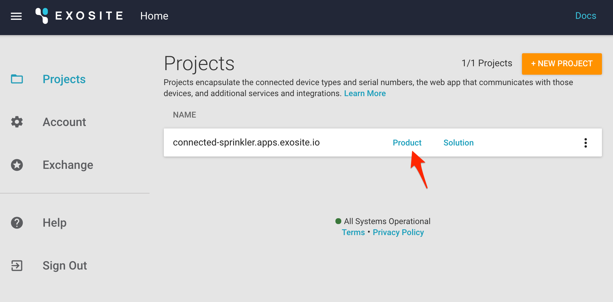

2. Click the Settings tab.

   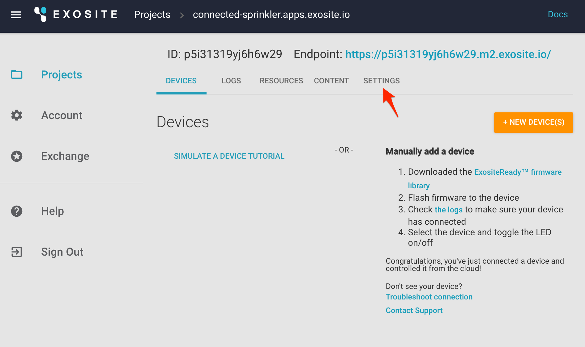

3. We'll keep the default "Token" based authentication for now and leave "Allow development devices to connect" unchecked, because we're making all of our API calls over a secure connection (HTTPS). Scroll down to the Provisioning section.

   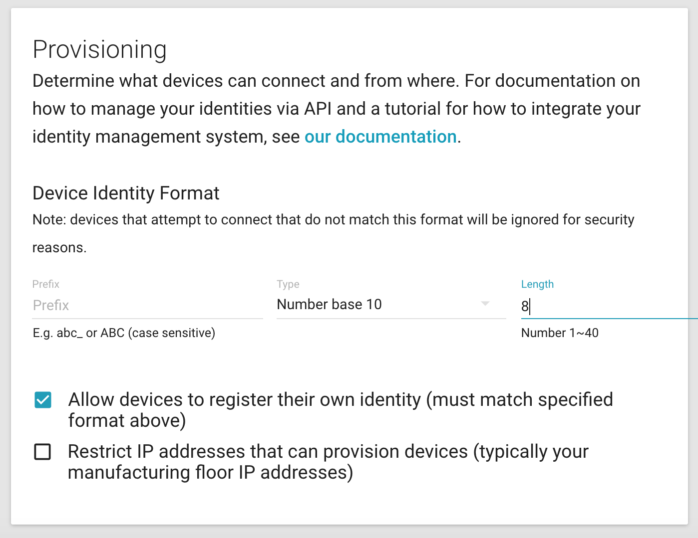

4. This is where you configure device identities for the product. There are a few things that may be configured about the identity format:

    - an optional prefix for all identities 
    - an identifier type. This may a number, be various MAC address formats if you are using, e.g., the MAC address from a WiFi chip to uniquely identify each device. It may be in UUIDv4 format. It may also be an opaque string of characters, meaning that it has no required format.
    - a length, if a specific length is required. Leave this blank if you want the length to be unlimited.

5. Check the box that says "Allow devices to register their own identity". What this means is that devices do not need to be specifically whitelisted in the system before they connect.

6. Uncheck the box that says "Restrict IP addresses..." This feature may be used to provision devices from a manufacturing facility that has a specfic set of IP addresses.

   

7. Press Save. We've now configured the provisioning settings for the product. Next we will whitelist some devices and provision them.


## Whitelist devices

Let's whitelist some devices. We'll do this in three ways: one at a time, in bulk by uploading a CSV file, and finally using an API call.

1. Click the Devices tab and then click "+ NEW DEVICE(S)" and "Add one device".

   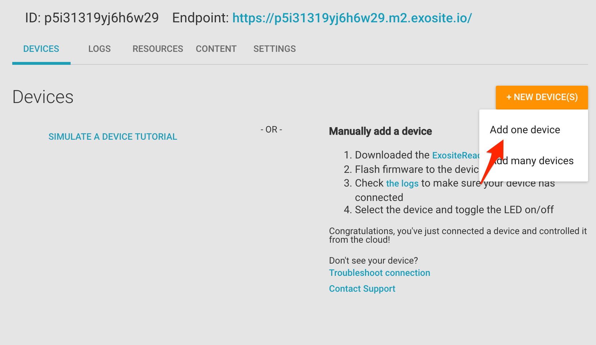

2. Enter a serial number. Recall that earlier in this tutorial we set the identity format to "Base 10" and a length of 8. The identity entered in this box must conform to that format. Notice too that there is a default activation period of 48 hours. This means that the device must be provisioned within 48 hours of being whitelisted.

   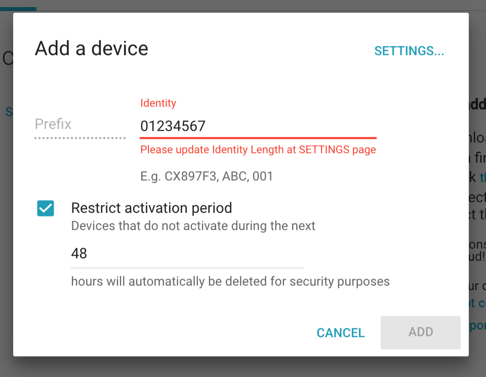

3. Click "Add" to create the device. You will see the device listed in a "whitelisted" status indicated by the tag icon on the left.

   

   (Tip: the filter tooltip menu provides a list of device status icons and their meanings.)

4. Next, let's whitelist several devices at once. Create a text file called `identities.csv` with the following content. Notice that the file is in Comma Separated Value (CSV) format and that the second column is intentionally left blank. If you don't wish to create this file you may download the example here: [identities.csv](assets/identities.csv)

```
ID,Certificate
00000001,
00000002,
00000003,
00000004,
00000005,
```

5. Click "+ NEW DEVICES" and then "Add many devices".

   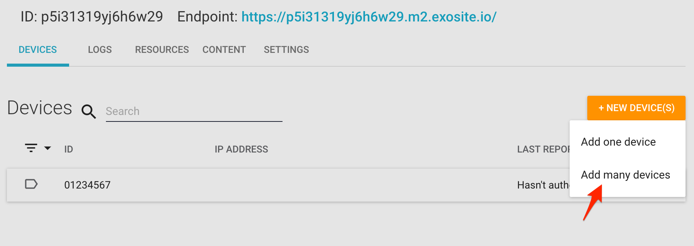

6. Click "UPLOAD CSV", navigate to the `identities.csv` file, and click "Add". Now additional devices are whitelisted.

   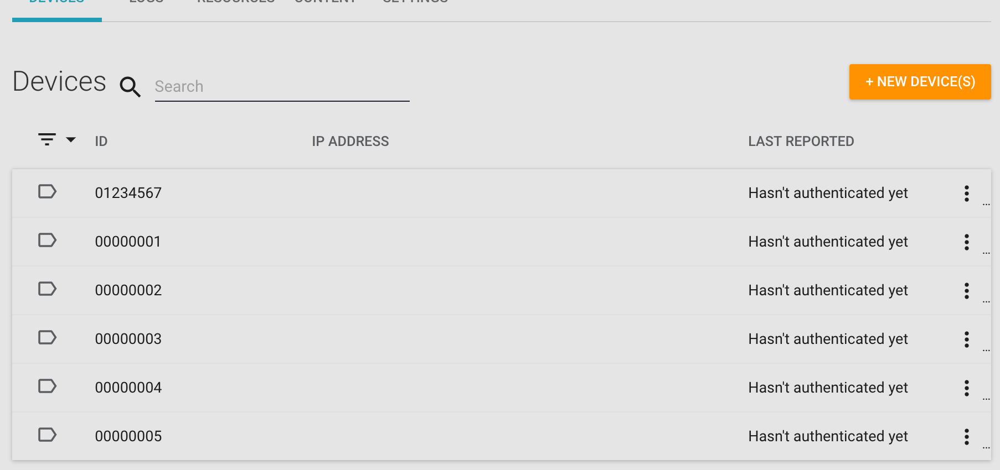

7. Finally let's whitelist a device the whitelist API. This allows the process of adding a device identity to be automated, as in a manufacturing environment at the time the device is produced. To make the call you'll need to make a Murano API token. Here's how to create one using a user email and password.

```
curl \
  -X POST 'https://api.exosite.io/api:1/token/' \
  -H 'Content-Type: application/json' \
  -d '{"email":"<me@mycompany.com>","password":"<password>","ttl":86400}'
```

8. Using the product ID (`<product-id>`) and token (`<token>`), whitelist an identity (`<identity>`). This call will respond with status of `204` if it succeeds.

```
curl \
  -i \
  -X PUT \
'https://api.exosite.io/api:1/service/<product-id>/device2/identity/<identity>' \
  -H 'Authorization: token <token>' \
  -H 'Content-Type: application/json' \
  -d '{"locked": false}'
```


## Provision a device (token authentication)

Whitelisting a device identity opens a fixed window of time in which the device may be provisioned. In the previous example we configured a 48 hour provision window. Let's now provision some of the devices we have whitelisted. Provisioning changes the device status to "Provisioned" and responds with a token that may be used in other device calls to authenticate. Using this token the device can read or write. 

Note: this step is only necessary for products that use token authentication. For TLS client certificate, please see that section below.

1. Click on the "Devices" tab. Find a device with the "whitelisted" status indicated by the white tag icon and note its ID. Also make note of the endpoint URL for device connectivity. We'll use these in the next step.

   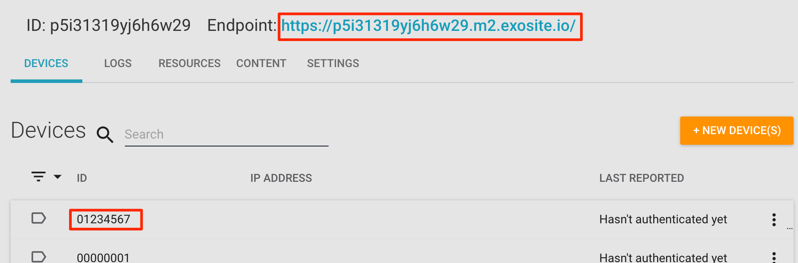


2. Make the following HTTP request to provision the device identity from the previous step and get its device token. This is a device HTTP API call and uses the product endpoint. Note that this is different from the Murano token obtained to do API-based whitelisting in the last section.

   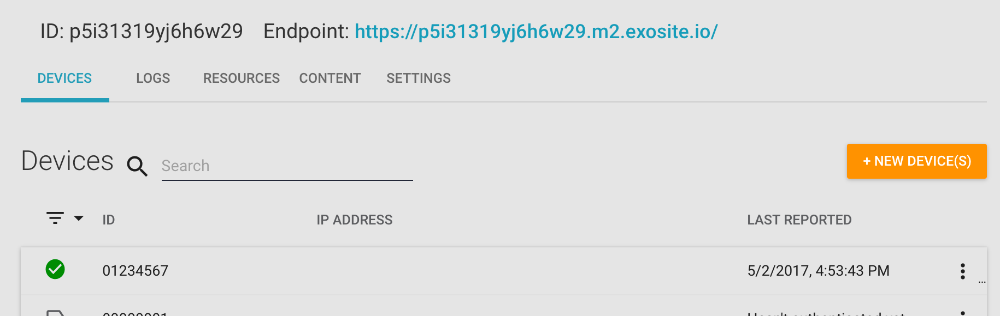

```
curl \
  -X POST '<product-endpoint>/provision/activate' \
  -H 'Content-Type: application/x-www-form-urlencoded; charset=utf-8' \
  -d 'sn=<identity>'
```

3. Confirm that the device is now displayed with an "provisioned" status icon.


   

4. Next click on the "Logs" tab. There you can see the provision event for this device. The Logs tab is a "live" view that displays events associated with this product's API endpoint that came in while the Murano product UI was running.

   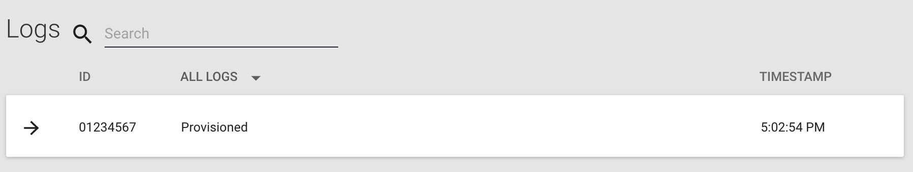

5. Finally perform a device write using the  the `<device-token>` obtained from the provision curl call and confirm that `HTTP/1.1 204 No Content` is returned from that call. Note that the device token goes in the `X-Exosite-CIK` header. 

```
curl -i \
  -X POST '<product-endpoint>/onep:v1/stack/alias' \
  -H 'X-Exosite-CIK: <device-token>' \
  -H 'Content-Type: application/x-www-form-urlencoded; charset=utf-8' \
  -d 'myalias=50'
```

5. Verify the write was logged.

   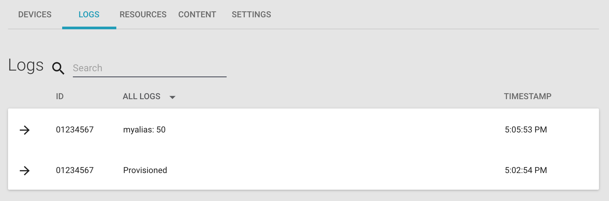

Note: Previous users of One Platform might be surprised to learn that the `myalias` resource does not need to be created before making the previous call. 


## Provision a device (TLS client certificate)

In the previous section we provisioned a device using token authentication. Next, let's use TLS client certificate. This provides enhanced security:

- no secret information needs to be transmitted in order to authenticate requests.
- the private key can be stored on a hardware security chip that makes it difficult to obtain the key

1. Go to the Settings tab and switch the product to use TLS Client Certificate. Note: this does not affect already provisioned devices, which retain their previous authentication type. Then press the Save button at the bottom of that page.

   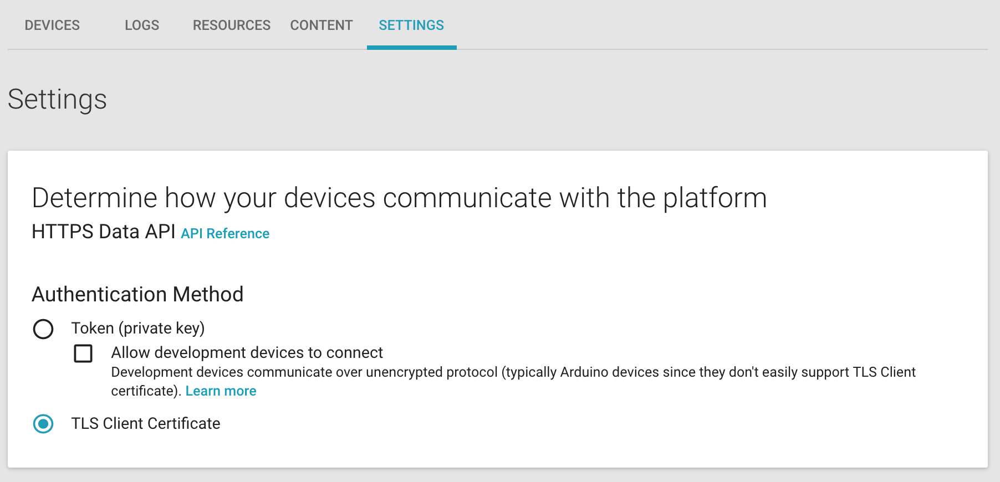
   

2. Next, find an identity that has not been provisioned yet. For this tutorial we'll pick `00000002`.

   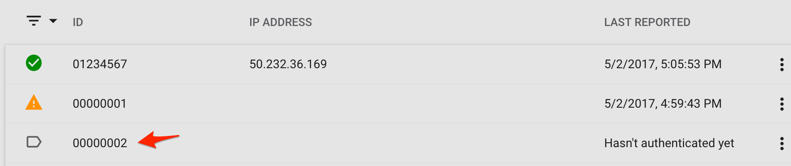

3. Next generate a certificate file. This will require a tool like [OpenSSL](https://www.openssl.org). The CN of the certificate must be set to the device ID.  For example, here's a command that generates a certificate good for 365 days:

```
openssl req -x509 -nodes -days 365 -sha256 -subj /C=US/ST=MN/L=Mpls/O=Exosite/CN=00000002 -newkey rsa:2048 -keyout adc-key.pem -out adc-cert.pem
```

- `-days 365` specifies that the certificate is valid for one year. Note that the certificate also gets a start time based on the current time on the machine generating the certificate. This may differ by a few seconds from the API's clock and cause subsequent API calls to fail until the API's clock catches up to the start time of the certificate. You can check the API time by calling `curl <product-endpoint>/timestamp`, which returns a timestamp in [seconds since the epoch](https://en.wikipedia.org/wiki/Unix_time).
- `-subj /C=US/ST=MN/L=Mpls/O=Exosite/CN=00000002` specifies a specific location, organization, and identity. You should set most of this appropriately for your business, but Murano's device API requires that the common name `/CN` be set to your device identity.


4. Combine the key and the cert into a single file using the ‘cat’ command:

```
cat adc-key.pem adc-cert.pem >> adc.pem
```

5. Provision the device. This may be done by making an HTTP API call using the certificate created above. We'll make a write call in this example. Note that the provisioning step here is combined with the first write to the API. The steps differ somewhat based the operating system you are using.

In Linux, you can use the PEM file generated above directly:
```
curl -v "<product-endpoint>/onep:v1/stack/alias" -d 'myalias=55' -E ./adc.pem
```

In OSX, you should transform the PEM file into a PFX file and use that:
```
openssl pkcs12 -export -out adc.pfx -in adc.pem -password pass:guest
curl -v "<product-endpoint>/onep:v1/stack/alias" -d 'myalias=55' -E adc.pfx:guest
```

6. The first time you write with the certificate you will see two events in the log: a provision event and a write event.

   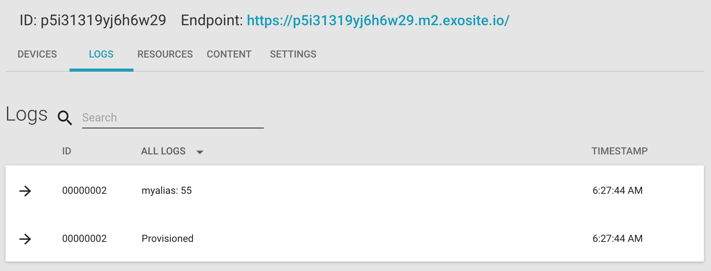

Here is a full certificate creation sequence on an OSX box:

```
$ openssl req -x509 -nodes -days 365 -sha256 -subj /C=US/ST=MN/L=Mpls/O=Exosite/CN=00000002 -newkey rsa:2048 -keyout adc-key.pem -out adc-cert.pem
Generating a 2048 bit RSA private key
................................+++
.+++
writing new private key to 'adc-key.pem'
-----
$ cat adc-key.pem adc-cert.pem >> adc.pem
$ openssl pkcs12 -export -out adc.pfx -in adc.pem -password pass:guest
$ curl -v https://p5i31319yj6h6w29.m2.exosite.io/onep:v1/stack/alias -d 'myalias=55' -E adc.pfx:guest
*   Trying 52.9.81.106...
* TCP_NODELAY set
* Connected to p5i31319yj6h6w29.m2.exosite.io (52.9.81.106) port 443 (#0)
* WARNING: SSL: Certificate type not set, assuming PKCS#12 format.
* Client certificate: 00000002
* TLS 1.2 connection using TLS_ECDHE_RSA_WITH_AES_128_GCM_SHA256
* Server certificate: *.m2.exosite.io
* Server certificate: RapidSSL SHA256 CA
* Server certificate: GeoTrust Global CA
> POST /onep:v1/stack/alias HTTP/1.1
> Host: p5i31319yj6h6w29.m2.exosite.io
> User-Agent: curl/7.51.0
> Accept: */*
> Content-Length: 10
> Content-Type: application/x-www-form-urlencoded
>
* upload completely sent off: 10 out of 10 bytes
< HTTP/1.1 204 No Content
< content-length: 0
< date: Wed, 03 May 2017 11:27:44 GMT
< server: Cowboy
<
* Curl_http_done: called premature == 0
* Connection #0 to host p5i31319yj6h6w29.m2.exosite.io left intact
```
